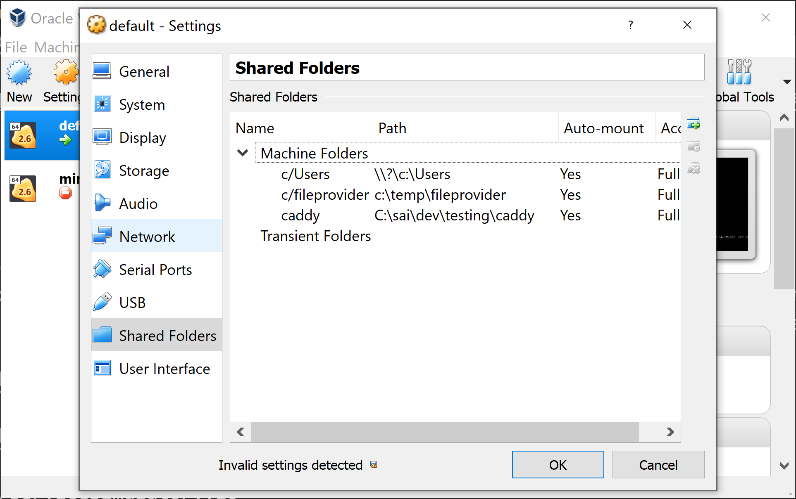

```cmd
cd deploy
docker login
docker build -f .\Dockerfile -t servicesimulator:v12 .
docker run -it -p:3000:80 servicesimulator:v12
Invoke-WebRequest http://192.168.99.100:3000/service1 ( get from docker inspect)
map the folder: (folderpath)c:\temp\fileprovider to (foldername)c/fileprovider  ( Note: see no : in the folder name)

docker run -it -v //c/temp://data/fileprovider -p:3000:80 service-simulator:latest
docker run -it -v //c/temp/simdata://data/fileprovider -p:3000:80 servicesimulator:v12
docker run -it -v //c/fileprovider://data/fileprovider -p:3000:80 service-simulator:latest /bin/sh
```

VM Oracle Virtual Box for settings.

[Docker on Windows — Mounting Host Directories](https://rominirani.com/docker-on-windows-mounting-host-directories-d96f3f056a2c)

[Fixing Volumes in Docker Toolbox](https://medium.com/@Charles_Stover/fixing-volumes-in-docker-toolbox-4ad5ace0e572)
```cmd
    docker-machine stop
    docker-machine start
```
### Windows 10 home box
Docker tool box needs to be installed (legacy docker solution)
Legacy desktop solution. Docker Toolbox is for older Mac and Windows systems that do not meet the requirements of Docker Desktop for Mac and Docker Desktop for Windows. We recommend updating to the newer applications, if possible.

[Setup Docker on Windows Server 2016](https://blog.couchbase.com/setup-docker-windows-server-2016/)

[Pushing to docker](https://ropenscilabs.github.io/r-docker-tutorial/04-Dockerhub.html)
    * docker login
    * docker tag 4f28842d9e99 sairamaj/servicesimulator:v12
    * docker push sairamaj/servicesimulator:v12

[Enable TLS in Azure Container](https://www.antstack.io/blog/how-to-enable-tls-for-hasura-graphql-engine-in-azure-caddy/)

#### Caddy
[docker-caddy](https://hub.docker.com/_/caddy)

```cmd
docker run -d -p 80:80 -v /caddy/index.html:/usr/share/caddy/index.html -v caddy_data:/data caddy
```

