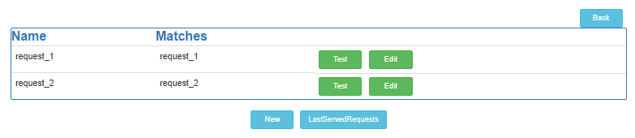
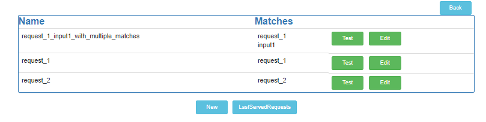
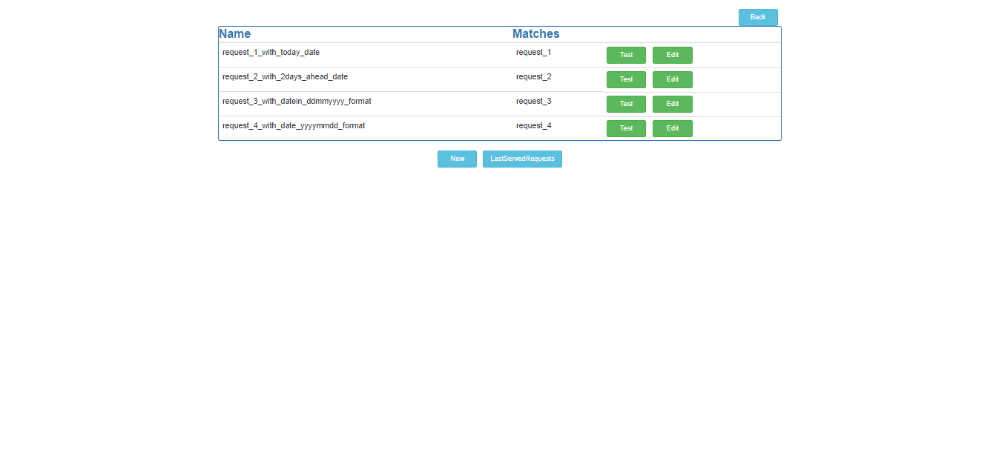
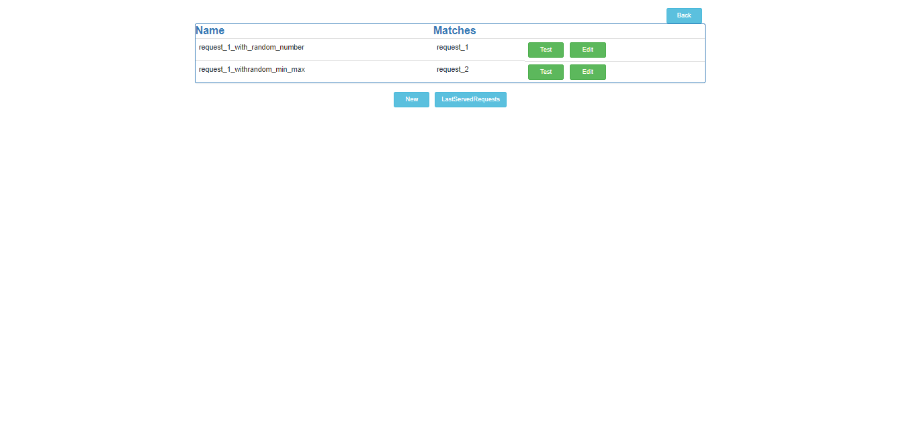
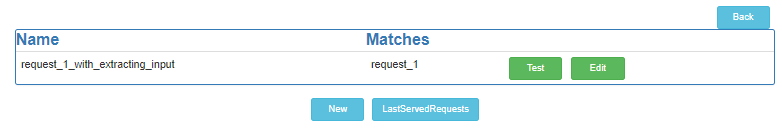
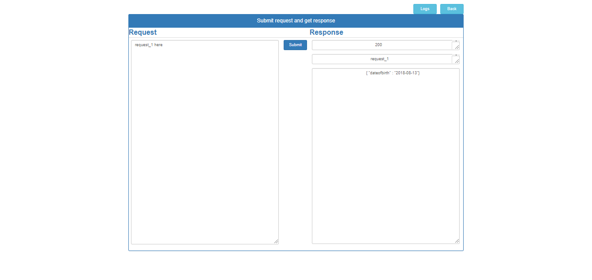
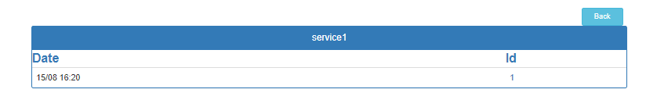
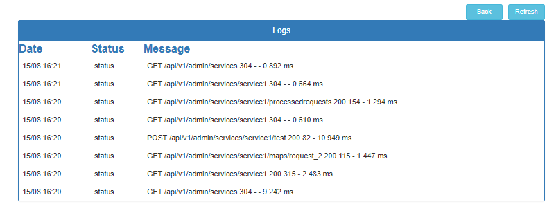

# Home
Here you will see all the services available from this simulator. One can create a new service using New service button.

## Create New Service 
One can create new service by giving a unique name. The type of services supported are __soap__ and __json__. Currently there is no validation on this and hence type exactly (soap or json)

## Service responses with different formats

### Service showing simple request and response 

### Service showing with multiple matches.

### Service showing using dynamic date with different format 

### Service showing random numbers in the response

### Service showing the response to extract a value from request

## Adding a new test case

## Testing service

### Getting response with matching request.

## Viewing the Posted requests.

## Viewing Logs

