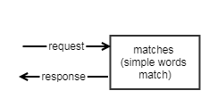
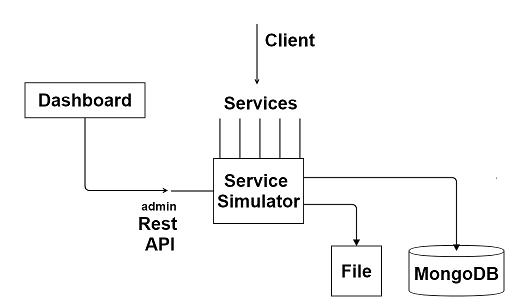
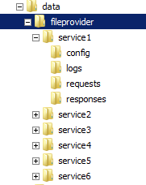

# Service-Simulator
Service simulator app will allow you to write simulation data for any http service. It is simple matching some inputs with request and then respond accordingly. 

  

  ### Overview
  

## Features
* dynamic end points (each service listens at different urls).
* multiple matches in request to generate different responses
* dynamic templates for __dates__, __random numbers__, __extracting data from request__ to embed in response, __linking to   external data__.
* test the responses before publishing.
* Capture request arrived and responses served for service.
* Performance and troubleshooting logging
* dashboard ui to view/edit

## Technology
* NodeJS
* TypeScript
* Angular 2.0
* MongoDB
* Azure container
* Handlebars module for template

# Terminology
### Service  
Listens at particular Url and accepts request and sends response.
### Matches
Match strings matched against to request to find out which response needs to be sent.
### Request
POST/PATCH/PUT string coming from the client.
### Response
Data sent back to client for matched request.
### Templating
Response data can have some dynamic templating for dates, random numbers and extracting some data from input.
### Provider
Data provider which serves the response
#### In memory provider
* Used for testing purpose
#### File provider
* Configuration and Responses are stored on file system.
#### Mongo Db Provider
* Configuration and Responses are stored in Mongo DB.
#### Served Requests
* Requests will be logged along with responses sent to trouble shooting

## Configuration
### In Memory

testdata.json is used for in memory and is used for unit test. The entire configuration is part of single json file. Simple configuration is like below

```json
[
    {
        "name": "service1name",
        "config" :[
            {
            "name" : "testcase1 name here",
            "matches" :[
                "match1","match2"
            ],
            "request": "sample request here",
            "response" : "sample response here"
            },
            {
            "name" : "testcase2 name here",
            "matches" :[
                "match1","match2"
            ],
            "request": "sample request here",
            "response" : "sample response here"
            }            
        ]
    },
    {
        "name": "service2name",
        "config" :[
            {
            "name" : "testcase name here",
            "matches" :[
                "match1","match2"
                ],
            "request": "sample request here",
            "response" : "sample response here"
            }
        ]
    },

]

```
Sample JSON file can be viewed here
[testdata](../api/data/inmemory/testdata.json)


```json
 {
        "name": "service1",
        "config": [
            {
                "name": "request_1",
                "matches": [
                    "request_1"
                ],
                "request": "request_1 here",
                "response": "<xml>service1_response_1</xml>"
            },
            {
                "name": "request_2",
                "matches": [
                    "request_2"
                ],
                "request": "request_2 here",
                "response": "<xml>service1_response_2</xml>"
            }
        ]
    },
```
In above we have a __service1__ which will be exposed and has 2 test cases. 

### File Provider

Below shows the file system.

Each directory under fileprovider will is a service. It will have below 4 directories 

### config
    Contains single json file which has mapping of requests and responses.
```json
    [
        {
            "name": "request_1",
            "matches": [
                "request_1"
            ]
        },
        {
            "name": "request_2",
            "matches": [
                "request_2"
            ]
        }
    ]
```
* name
    * Name used which represents the response for the match found
    * If there is an extension .JPEG or .PNG then the response will be returned as binary data
    * If no extension exists , a default .xml extensionis added and looked in responses directory.
* matches:
    * Array of string matches
    * One can specify multiple strings here.

### logs
Request along with served responses will be logged here
### requests
Sample request files (used during testing in dashboard). The name of the file will be name specified in the configuration file with .xml as extension.
### responses
Response files will be here. The name of the file is name specified in the match with .xml extension if no extension specified in the name in config.

### Mongo Db Provider
One can configure to use Mongo db with connection string so that all requests and responses along with configuration will be stored in Mongo db.

# How to build it
* Clone the repository
* At command prompt
    * Run __buildAll__ ( *first time takes time as it installs node modules*)
    * Run __deploy__
        * which will ask you to remove deploy directory
    * The deploy directory is your entire package 

# How to run it
* Running Locally
    * in deploy directory 
        * run setup.bat (*one time*)
        * node dist\index.js
    * Open browser and http://localhost:3000 to open dashboard
* Running as Windows Service
    * In deploy directory
        * node installAsService.js
    * use service control manager start __service-simulator__ service 
* Running in Azure Container
    * [here](./azure/README.MD)

## Running with different providers
Default is in memory (uses data\inmemory\testdata.json)

* Running File provider
    * Run __runwithfileprovider.bat__
* Running with Mongo db provider
    * Change mongodb provider connection in runwithmongoprovider.bat (if mongo is not local)
    * Run __runwithmongoprovider.bat__

## Using https
By default localhost.crt localhost.key are available and you can use them. Import localhost.crt in to your Trusted Root store so that you won't get warning when using in browser and also in powershell.

## Test it
* Running unit test
    * cd api
    * npm test

## Dashboard
Default dashboard is available at http://localhost:3000 and https://localhost:3443. Dashboard is explained  [here](../dashboard/readme.md)


